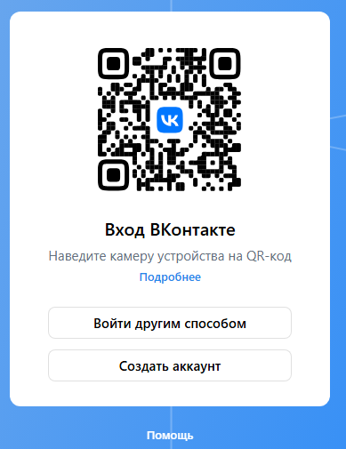
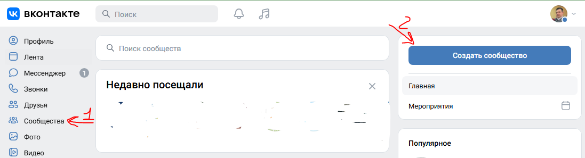
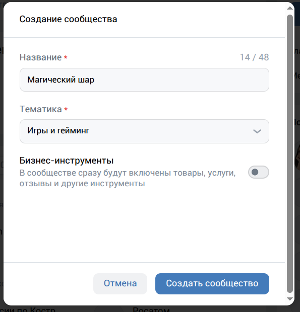
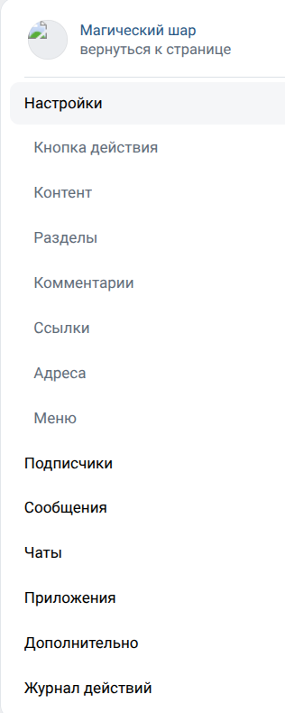
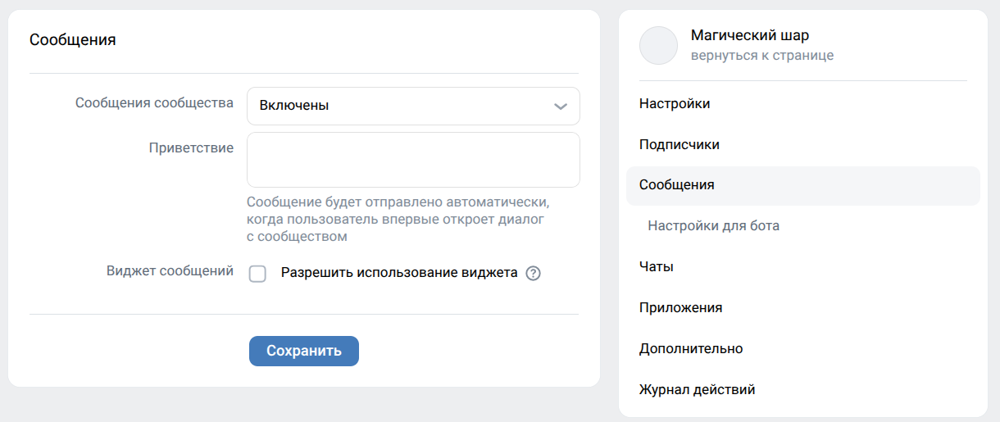
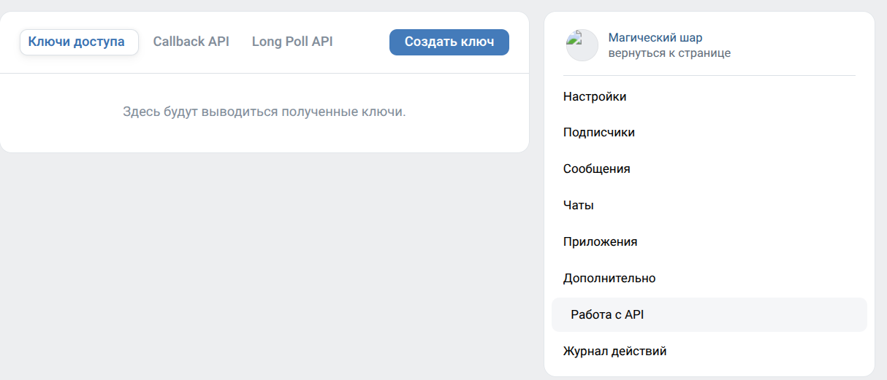
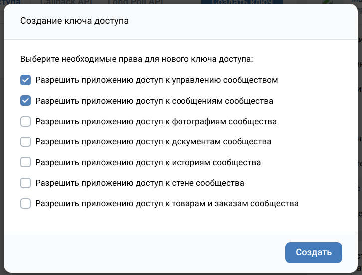
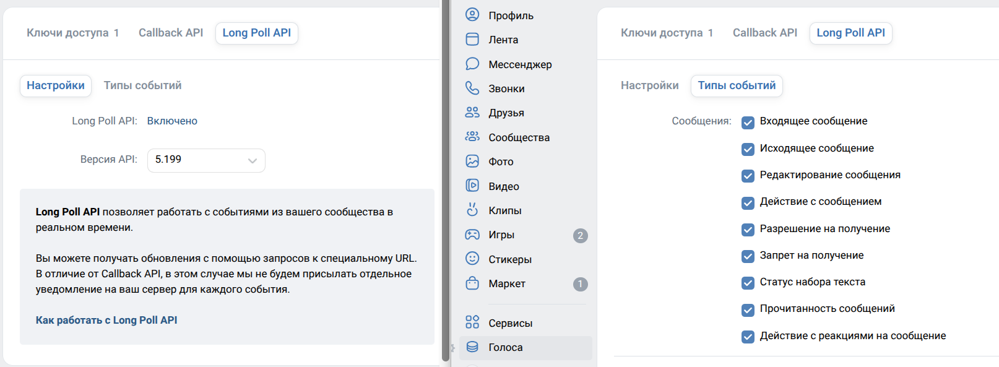

# Рабочая тетрадь

## Занятие 1. Регистрация и настройка ВК чат-бота

**Курс 1** · **Модуль** «Разработка ВК чат-ботов»

| Поле | Заполнение |
|---|---|
| ФИО ученика | _________________________ |
| Группа | _________________________ |
| Дата занятия | _________________________ |

---

## О занятии

**Цели занятия**

1. Создать сообщество ВКонтакте — будущий «дом» нашего бота.
2. Включить приём сообщений в сообществе.
3. Получить ключ доступа (токен) и понять правила его хранения.
4. Включить Bots Long Poll API и подписку на новые сообщения.
5. Убедиться, что сообщество готово к написанию кода бота.

**Что понадобится**

- Компьютер с браузером (Chrome, Firefox, Edge или Яндекс Браузер).
- Личный аккаунт ВКонтакте.
- Устанавливать программы сегодня не нужно: вся работа проходит в браузере на сайте vk.com.

**Как работать с тетрадью**

- **Классная работа** — выполняйте шаги вместе с преподавателем.
- **Домашняя работа** — выполните задания самостоятельно.

# Часть 1. Классная работа

### Шаг 1. Вход в ВКонтакте

**Что делаем.** Открываем сайт vk.com и входим в свой аккаунт.

**Проверь себя.** Вверху сайта видно ваше имя; вводить логин и пароль больше не просят.

*Рис. 1. Экран входа (или главная страница) ВКонтакте.*

- [ ] шаг выполнен

---

### Шаг 2. Открываем раздел «Сообщества»

**Что делаем.** В левом меню vk.com выбираем пункт «Сообщества» (или переходим по адресу vk.com/groups).

**Проверь себя.** На экране виден список «Мои сообщества» и кнопка «Создать сообщество».

*Рис. 2. Раздел «Сообщества» с кнопкой «Создать сообщество».*

- [ ] шаг выполнен

---

### Шаг 3. Создаём сообщество

**Что делаем.** Жмём кнопку «Создать сообщество», вводим название и выбираем тип «Группа» (или «Публичная страница» — для бота принципиальной разницы нет).

**💡 Вариативность (классная работа).** Если в списке типов сообщества будет пункт «Встреча» или «Мероприятие» — не выбираем его: для бота подходит только «Группа» или «Публичная страница».

**Проверь себя.** В списке сообществ появилось новое сообщество с названием «Магический шар» (или выбранным вами вариантом).

*Рис. 3. Окно создания сообщества: название и выбор типа.*

- [ ] шаг выполнен

---

### Шаг 4. Открываем «Управление» сообществом

**Что делаем.** Переходим в своё сообщество и находим в меню пункт «Управление». Он может быть в главном меню сообщества, под обложкой или в выпадающем меню в виде шестерёнки.

**Проверь себя.** Открыто меню «Управление», в нём виден список разделов («Настройки», «Сообщения», «Работа с API» и другие).

*Рис. 4. Страница сообщества, меню «Управление».*

- [ ] шаг выполнен

---

### Шаг 5. Включаем сообщения сообщества

**Что делаем.** В настройках управления находим раздел «Сообщения» и включаем пункт «Сообщения сообщества».

**Проверь себя.** Переключатель «Сообщения сообщества» стал активным (цветным), а рядом появились дополнительные настройки.

*Рис. 5. Раздел «Сообщения», переключатель включён.*

- [ ] шаг выполнен

---
### Шаг 6. Получаем ключ доступа (токен)

**Что делаем.** В сообществе открываем «Управление» → «Дополнительно» → «Работа с API» → «Ключи доступа» и создаём [ключ доступа сообщества](https://dev.vk.com/ru/api/access-token/community-token). Для бота нужен ключ с правами `manage` и `messages`.

**⚠️ Важно.** Токен — секрет. Никому, кроме преподавателя, его не показываем. Копируем целиком, с первой и до последней буквы.

**💡 Вариативность (классная работа).** Можно использовать ранее созданный ключ сообщества, если он действителен и у него есть права `manage` и `messages`.

**Проверь себя.** Ключ создан, сохранён и никому не показан.

*Рис. 6. Раздел «Работа с API» — «Ключи доступа» (токен замазан).*

- [ ] шаг выполнен

---

### Шаг 7. Проверяем права ключа доступа

**Что делаем.** При создании ключа включаем права **Управление сообществом** (`manage`) и **Сообщения сообщества** (`messages`). Не включаем права, которые боту не нужны.

**💡 Вариативность (классная работа).** Названия пунктов в интерфейсе могут отличаться; ориентируйтесь на описание прав `manage` и `messages` в окне создания ключа.

**Проверь себя.** У ключа есть права `manage` и `messages`; остальные права выключены.

*Рис. 7. Окно прав доступа: отмечены `manage` и `messages`.*

- [ ] шаг выполнен

---

### Шаг 8. Включаем Bots Long Poll API

**Что делаем.** В разделе «Управление» → «Дополнительно» → «Работа с API» открываем вкладку **Long Poll API** и включаем её. В разделе типов событий включаем **Входящее сообщение / `message_new`**. См. [документацию Bots Long Poll API](https://dev.vk.com/ru/api/bots-long-poll/getting-started).

**Проверь себя.** Bots Long Poll API включён, событие `message_new` отмечено.

*Рис. 8. Bots Long Poll API включён, событие `message_new` выбрано.*

- [ ] шаг выполнен

---

### Шаг 9. Итоговая проверка и фиксация результатов

**Что делаем.** Пробуем написать сообщение своему сообществу от имени личного аккаунта, после чего проверяем: пункт **«Сообщения сообщества»** включён, **Bots Long Poll API** включён, событие `message_new` включено, ключ доступа сохранён.

*Рис. 9. Отправленное сообщение в диалоге с сообществом.*

**Результаты занятия (заполняем вместе с преподавателем):**

| Название сообщества | |
|---|---|
| Тип сообщества (Группа / Публичная страница) | |
| Сообщения сообщества включены? | да / нет |
| Bots Long Poll API включён? | да / нет |
| Событие `message_new` включено? | да / нет |
| Токен сохранён (где)? | |
| Примечания | |

---

## Часть 2. Домашняя работа

> **Правила выполнения.** Выполняйте задания самостоятельно. В заданиях с пометкой **«Вариативность»** выберите свой вариант.

### Задание 1. Повторение: вход и раздел сообществ

**Что делаем.** Повторяем Шаги 1–2 из классной работы: входим в ВКонтакте и открываем раздел «Сообщества».

- [ ] выполню вход в свой аккаунт
- [ ] открою раздел «Сообщества»

---
### Задание 2. Повторение: создание сообщества для «Оракула»

**Что делаем.** Создаём второе сообщество — для домашнего бота «Оракул».

**💡 Вариативность.** «Оракул» отвечает на вопросы, как и «Магический шар», но его фишка — в вашем оформлении. Название выбираем своё: например, «Оракул Ивана», «Мудрый шар», «Предсказатель». Главное, чтобы название отличалось от классного бота и было видно, что это ваш проект. Тип — «Группа» или «Публичная страница», на ваш выбор.

**Проверь себя.** В списке сообществ появилось ваше сообщество «Оракул…», тип — не «Встреча».

- [ ] создал(а) сообщество «Оракул»

---

### Задание 3. Повторение: управление сообществом

**Что делаем.** В своём новом сообществе открываем пункт «Управление».

**Проверь себя.** Меню «Управление» видно на странице сообщества.

- [ ] нашёл(ла) меню «Управление»

---

### Задание 4. Повторение: включение сообщений

**Что делаем.** Включаем в сообществе «Оракул» пункт «Сообщения сообщества».

**Проверь себя.** В разделе «Сообщения» виден включённый переключатель; диалог с сообществом открылся и в нём можно писать.

- [ ] сообщения сообщества включены

---

### Задание 5. Повторение: токен и права для «Оракула»

**Что делаем.** В сообществе «Оракул» открываем «Управление» → «Дополнительно» → «Работа с API» → «Ключи доступа» и создаём отдельный ключ с правами `manage` и `messages`.

**💡 Вариативность.** Сохраните ключ рядом с первым, подпишите, к какому сообществу он относится.

**Проверь себя.** Ключ для «Оракула» создан с правами `manage` и `messages`, сохранён отдельно и никому не показан.

- [ ] токен для «Оракула» получен и сохранён

---

### Задание 6. Повторение: Bots Long Poll API для «Оракула»

**Что делаем.** Включаем Bots Long Poll API в сообществе «Оракул» и событие **Входящее сообщение / `message_new`**.

**Проверь себя.** Bots Long Poll API включён, событие `message_new` отмечено.

- [ ] Bots Long Poll API и событие `message_new` включены

---
### Задание 7. Ответы на вопросы

**Отвечаем своими словами** (1–2 предложения на вопрос).

1. Зачем сообществу нужен токен?

   ____________________________________________________________
   ____________________________________________________________

2. Почему токен нельзя показывать никому?

   ____________________________________________________________
   ____________________________________________________________

3. Как называется технология, по которой сервер сам сообщает боту о новых событиях?

   ____________________________________________________________
   ____________________________________________________________

---

### Задание 8. Итоговая проверка

**Что делаем.** Открываем своё сообщество «Оракул» и проверяем, что всё готово:
1) название сообщества (ваша вариативность);
2) включённый пункт **«Сообщения сообщества»**;
3) включённый Bots Long Poll API и событие `message_new`;
4) токен сохранён в блокноте отдельно от токена «Магического шара».

**Как проверить правильность выполнения домашней работы**

Проверьте себя по чек-листу — работа выполнена верно, если выполняется **всё** из списка:

1. **Сообщество создано.** В разделе «Сообщества» видно сообщество «Оракул» (или ваше название). Тип — «Группа» или «Публичная страница».
2. **Сообщения включены.** В «Управлении» → «Сообщения» переключатель включён, и от личного аккаунта можно написать сообщение сообществу.
3. **Ключ получен.** В «Управлении» → «Дополнительно» → «Работа с API» → «Ключи доступа» создан ключ сообщества, он сохранён и никому не отправлен.
4. **Права настроены.** У ключа есть права `manage` и `messages`.
5. **Bots Long Poll API включён.** Отмечено событие `message_new`.
6. **Токены не перепутаны.** Токен «Оракула» лежит отдельно от токена «Магического шара».
7. **Подключение готово.** Сообщения сообщества включены, ключ доступа сохранён, событие `message_new` включено.

**Если какой-то пункт не выполняется** — повторите соответствующий шаг классной работы и перепроверьте себя.

Если всё выполнено — оба сообщества готовы! На следующем занятии установим язык программирования, на котором будут написаны «Магический шар» и «Оракул».

---

*Рабочая тетрадь · Курс 1 · Модуль «Разработка ВК чат-ботов» · Занятие 1 «Регистрация и настройка ВК чат-бота»*